# 测试

## BpTree测试数据

测试内存中BpTree的性能.因为顺序读需要访问内存中的vector，

参数：
1. key大小 8bytes
2. value大小 256 bytes
3. key总空间 1G
4. value总空间 4G

### 400_000kv 100M

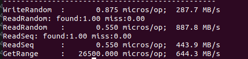

### 4_000_000KV 1G

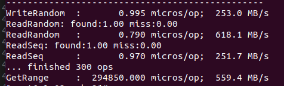

### 8_000_000KV 2G

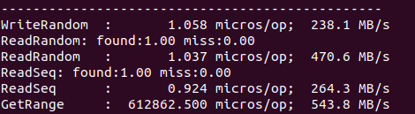

### 16_000_000KV 4G

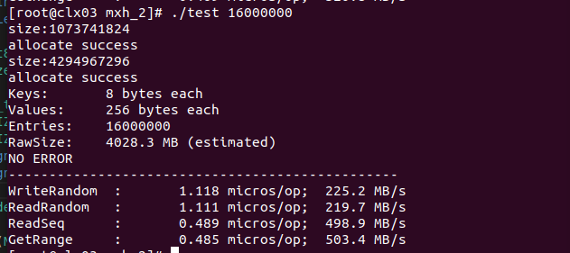

## Scaled_KV测试

测试学长的Scaled_KV本身的性能。

测试参数：
1. key大小 8bytes
2. value大小 256 bytes
3. key总空间 10G
4. value总空间 60G

### 400_000kv 100M

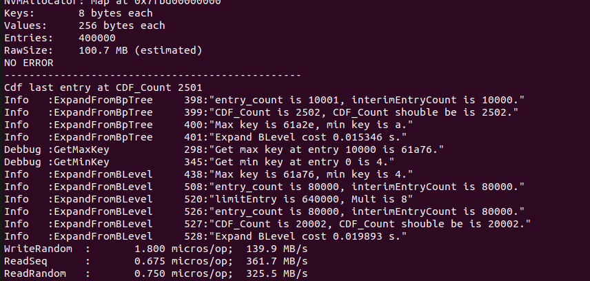

### 4_000_000KV 1G

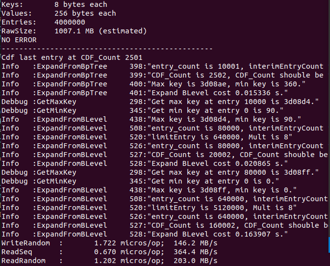

### 40_000_000KV 10G

测出来的数据开始不正常，所以多放几张截图表示不是偶然原因造成的错误。

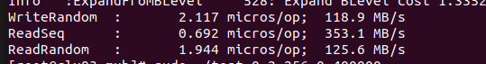

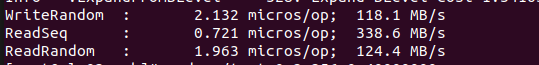

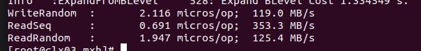

### 80_000_000KV 20G

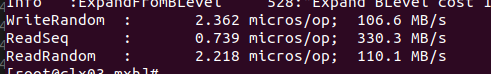

### 120_000_000KV 30G

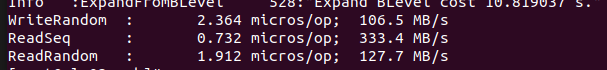

## Scaled_KV测试2

上述的测试对于ReadSeq有较大的Miss率（40%左右），所以在改进了db_bench后对读进行重测，同时增加对GetRange的测试。改进后的测试会对写性能有明显影响，所以单独列出来。

参数：
测试参数：
1. key大小 8bytes
2. value大小 256 bytes
3. key总空间 10G
4. value总空间 60G
5. GetRange range大小 10000

### 4_000_000KV 1G

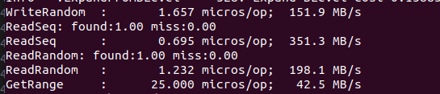

### 40_000_000KV 10G

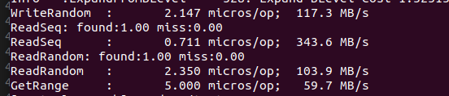

### 80_000_000KV 20G

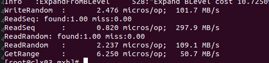

### 120_000_000KV 30G

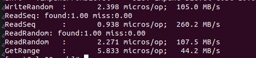

## ScaledKV With BpTree

参数：
1. key大小 8bytes
2. value大小 256 bytes
3. key总空间 10G
4. value总空间 60G
5. GetRange range大小 10000
6. BpTree kv数目限制 10000

### 4_000_000KV 1G

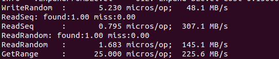

### 40_000_000KV 10G

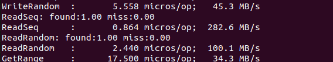

### 80_000_000KV 20G

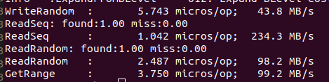

### 120_000_000KV 30G

