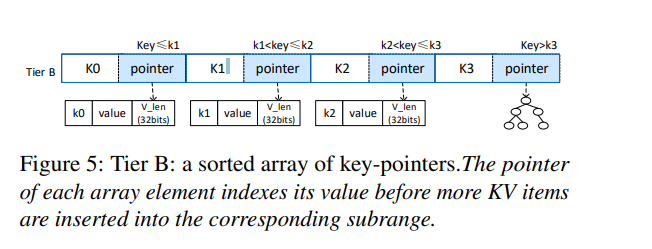
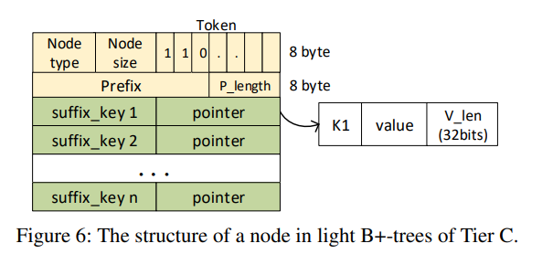

- [1. 论文阅读方法](#1-%e8%ae%ba%e6%96%87%e9%98%85%e8%af%bb%e6%96%b9%e6%b3%95)
  - [1.1. Surveying the Article](#11-surveying-the-article)
  - [1.2. Reading the Article](#12-reading-the-article)
  - [1.3. Take Notes](#13-take-notes)
    - [1.3.1. Surverying](#131-surverying)
    - [1.3.2. Reading](#132-reading)
    - [1.3.3. 引言](#133-%e5%bc%95%e8%a8%80)
    - [1.3.4. 背景](#134-%e8%83%8c%e6%99%af)
      - [1.3.4.1. NVM](#1341-nvm)
    - [Combo-Tree Design](#combo-tree-design)
      - [Tier A](#tier-a)
      - [Tier B](#tier-b)
      - [Tier C](#tier-c)
      - [Scalable and background resizing](#scalable-and-background-resizing)

# 1. 论文阅读方法

## 1.1. Surveying the Article

1. 阅读标题和关键词。
2. 读摘要。看论文基本内容、方法特色、主要贡献。
3. 看结论。

## 1.2. Reading the Article

1. 读表和数据
2. 读引言。了解研究的背景和要解决的问题。
3. 读结果和讨论。
4. 都实验部分。

## 1.3. Take Notes

### 1.3.1. Surverying

1. 要解决的问题：NVM上的索引结构。
2. 已有如B-Tree、B+Tree、跳表等索引结构的问题：
   1. 不同操作的性能差距很大。如hash在单点插入、查找和删除上性能十分优秀，但是却不支持范围查找。跳表和其他树状结构支持高性能的范围查找，但是单点查找性能却不够。
   2. 随着数据量增大，各项操作性能变差。如数据量变大的时候，hash需要调整hash桶的大小来减少冲突。跳表和树状索引的各项操作也都是lg(n)。
3. 目标：提供类似hash的单点操作性能并且不牺牲范围查找性能，同时具有可扩展性的树状索引结构。
4. 结果：Combo-Tree 一个三层结构的索引，具有非侵入性背景调整策略。
   1. 中间层：排序好的key指针数组。用来优化Scan操作。
   2. 顶层：使用一个累计分布函数来在常数时间内快速定位单个key。
   3. 底层：存储特定范围内的k/v对（由两个相邻的中间层组成）和一部分B+tree。
   4. 背景调整策略用来在扩大容量的时候提供良好的响应性能，并且没有阻塞。
   5. 结论：和传统的NVM索引结构相比性能提升很大。（问题：什么叫传统的NVM索引。感觉就是传统索引？我们的方案也没有针对NVM?）
   
> 读了引言之后发现我们使用的NVM特性可能是：NVM使得内存变大，索引结构可以设计的更为复杂，占用更多的内存。

>读了一点代码后发现NVM提供的持久化特性用起来确实方便很多。

> 传统的NVM索引指的是参考的几篇论文（实验测试中作为参考对照的几个结构）
    

### 1.3.2. Reading

Combo-Tree的整体结构如下：

第一层的结构如下：

第二层结构如下:

第三层结构如下：

### 1.3.3. 引言

和Sureveying中的描述一致。

### 1.3.4. 背景

#### 1.3.4.1. NVM

1. 支持快速的、指针构成的索引结构（字节可寻址）
2. 支持容量增加的主存系统，这使得索引结构的可扩展性成为一项重大挑战
3. 提供高性能的线程并发访问。已有lock-based/lock-free的并发控制方案和HTM。
4. NVM支持的原子写大小为8bytes，而cache line的大小为64bytes，所以进行一致性的支持是要解决的问题。主要是要避免CPU对内存写操作的重排序，解决方案有：
   1. 让B+树子节点无序
   2. 使用8bytes的原子写来更新
   3. 创造多本版b树的副本
   4. 使用epoch编程

### Combo-Tree Design

#### Tier A

CDF:

1. 为什么使用CDF而不是其他hash函数。
2. CDF(x)代表小于等于x的变量的比重.具体计算公式如下：

3. 对应偏移的计算如下：
   

> CDF的offset计算公式中的加一。Tier A的数目是N/span+1是向上取整，计算在Tier B中的offset的时候加一是算上自己。
> 感觉CDF对重复的Key会存在问题?Tier A相当于一个cache？

读完之后，实际上CDF的作用是将一个key定位到Tier B中一个大小为Span的区间，其实是一个高度为2的跳表，不过是静态且不具有随机性。span无法进行动态变化，实际上不适应key分布的动态变化。

#### Tier B

B中的指针初始的时候直接指向key对应的value。当有key插入后则构造一棵B+Tree。

最初整个Combo Tree就是一个B+Tree。当B+Tree的大小超过限制，则把对应的叶子结点转化成Tier B.

#### Tier C

#### Scalable and background resizing

实验部分：
感觉这个实验结果比较奇怪。不理解测试数据的设计。
 