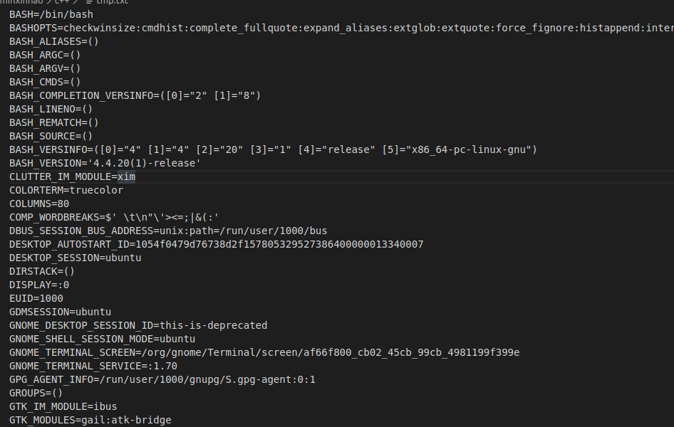
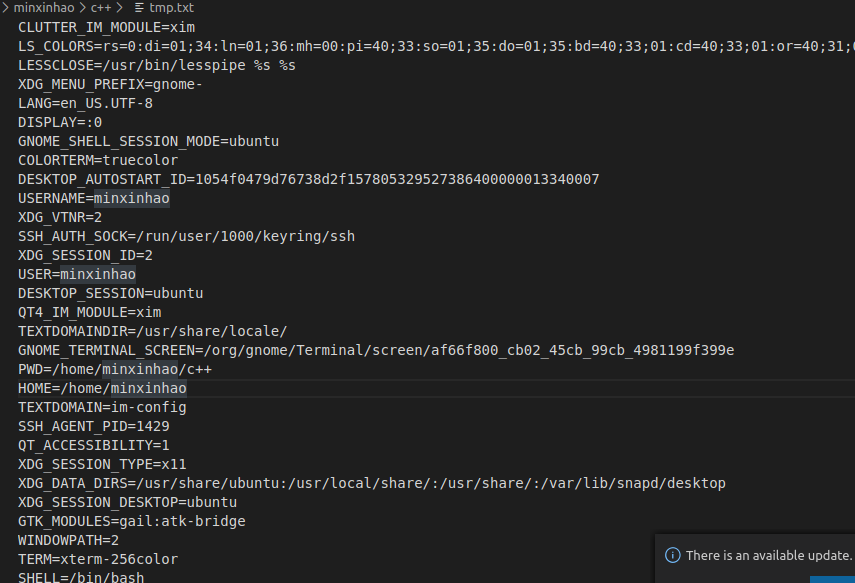
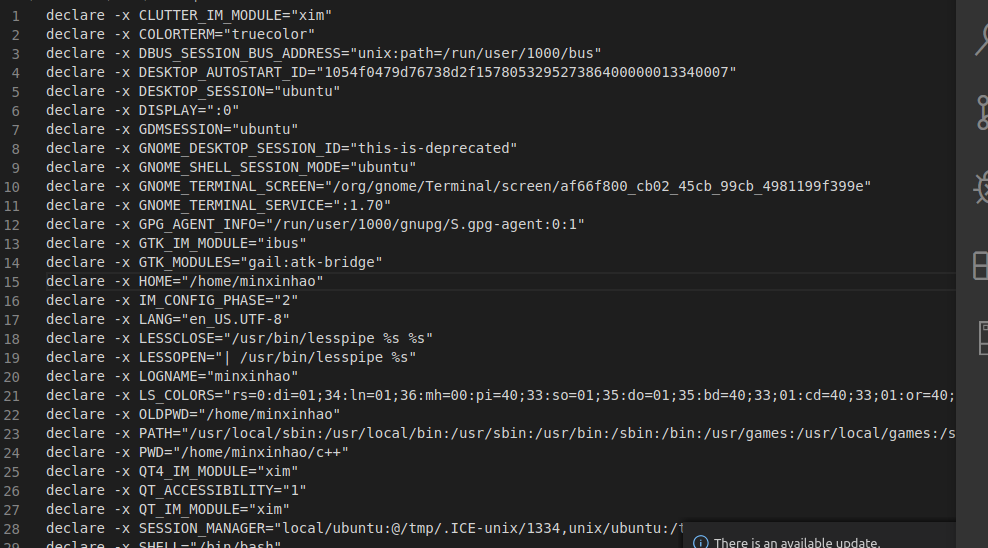

# Learn Environment Variables

[课程链接](https://www.shiyanlou.com/courses/1/learning/?id=60)

## 变量类型

1. 当前shell进程私有用户自定义变量
2. shell自身内建的变量
3. 从自定义变量导出的环境变量

相关的三个命令

1. set 显示当前shell所有变量
2. env 显示与当前用户相关的环境变量
3. export 显示从shell中导出成环境变量的变量

运行效果如下：








可以使用export命令将一个shell变量导出为临时的环境变量。

## 变量生存周期

按照变量的生存周期来划分，linux变量可以划分为两类：
1. 永久的：需要修改配置文件，变量永久生效；
2. 临时的：使用export命令声明，变量在关闭shell时失效

有两个重要的文件：
1. /etc/bashrc  存放shell变量
2. /etc/profile 存放环境变量

每个用户目录下的一个隐藏文件.profile，可以用 ls -a 查看.这个 .profile 只对当前用户永久生效。而写在 /etc/profile 里面的是对所有用户永久生效，所以如果想要添加一个永久生效的环境变量，只需要打开 /etc/profile，在最后加上你想添加的环境变量就好啦。

## 命令的查找路径和顺序

shell通过PATH环境变量来进行搜索。

PATH里面的路径是以：作为分割符的，所以添加的格式为：

```shell
$ PATH=$PATH:/home/minxinhao/bin
```

现在可以在任意目录执行那两个命令了（注意需要去掉前面的 ./）。你可能会意识到这样还并没有很好的解决问题，因为我给 PATH 环境变量追加了一个路径，它也只是在当前 Shell 有效，我一旦退出终端，再打开就会发现又失效了。有没有方法让添加的环境变量全局有效？或者每次启动 Shell 时自动执行上面添加自定义路径到 PATH 的命令？下面我们就来说说后一种方式——让它自动执行。

在每个用户的 home 目录中有一个 Shell 每次启动时会默认执行一个配置脚本，以初始化环境，包括添加一些用户自定义环境变量等等。zsh 的配置文件是 .zshrc，相应 Bash 的配置文件为 .bashrc 。它们在 etc 下还都有一个或多个全局的配置文件，不过我们一般只修改用户目录下的配置文件。

我们可以简单地使用下面命令直接添加内容到 .zshrc 中：

$ echo "PATH=$PATH:/home/minxinhao/bin" >> .zshrc

## 修改已有的变量

变量的修改有以下几种方式：

| 变量设置方式	                | 说明 |
|  ----  | ----  |
|${变量名#匹配字串}             |	从头向后开始匹配，删除符合匹配字串的最短数据 |
|${变量名##匹配字串}            |	从头向后开始匹配，删除符合匹配字串的最长数据 |
|${变量名%匹配字串}             |	从尾向前开始匹配，删除符合匹配字串的最短数据 |
|${变量名%%匹配字串}            |	从尾向前开始匹配，删除符合匹配字串的最长数据 |
|${变量名/旧的字串/新的字串}    |	将符合旧字串的第一个字串替换为新的字串 |
|${变量名//旧的字串/新的字串}   |	将符合旧字串的全部字串替换为新的字串 |

比如要修改我们前面添加到 PATH 的环境变量。为了避免操作失误导致命令找不到，我们先将 PATH 赋值给一个新的自定义变量 path：

```shell
$ path=$PATH
$ echo $path
$ path=${path%/home/minxinhao/bin}
#或使用通配符,*表示任意多个任意字符
$ path=${path%*/bin}
```

## 变量删除
可以使用 unset 命令删除一个环境变量：

```shell
$ unset temp
```

## 让环境变量生效

前面我们在 Shell 中修改了一个配置脚本文件之后（比如 zsh 的配置文件 home 目录下的 .zshrc），每次都要退出终端重新打开甚至重启主机之后其才能生效，很是麻烦，我们可以使用 source 命令来让其立即生效，如：

$ cd /home/shiyanlou
$ source .zshrc
copy
source 命令还有一个别名就是 .，上面的命令如果替换成 . 的方式就该是：

$ . ./.zshrc
copy
在使用.的时候，需要注意与表示当前路径的那个点区分开。

注意第一个点后面有一个空格，而且后面的文件必须指定完整的绝对或相对路径名，source 则不需要。