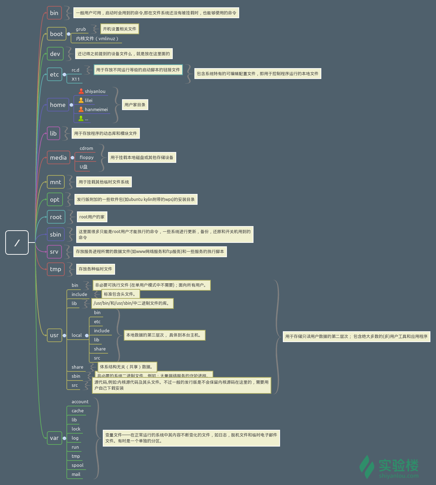

# Linux File System

FHS（英文：Filesystem Hierarchy Standard 中文：文件系统层次结构标准），多数 Linux 版本采用这种文件组织形式，FHS 定义了系统中每个区域的用途、所需要的最小构成的文件和目录同时还给出了例外处理与矛盾处理。

FHS 定义了两层规范，第一层是/ 下面的各个目录应该要放什么文件数据，例如 /etc 应该放置设置文件，/bin 与 /sbin 则应该放置可执行文件等等。

第二层则是针对 /usr 及 /var 这两个目录的子目录来定义。例如 /var/log 放置系统日志文件，/usr/share 放置共享数据等等。

[FHS文档](http://refspecs.linuxfoundation.org/FHS_2.3/fhs-2.3.pdf)

## bin

存放一般用户可用，启动时会用到的命令。即在文件系统还没有被挂在时，也能够使用的命令

## boot

### grub

开机设置相关文件

### vmlinuz

内核文件

## dev

设备文件

## etc

包含系统特有的可编辑配置文件

### rc.d

存放不同运行等级的启动脚本的链接文件

### X11

## home

存放所有用户的目录

## lib

用于存放程序的动态库和模块文件

## media

用于挂在本地磁盘或者其他存储设备

### cdrom

### floppy

### U盘

## mnt

用于挂载其他临时文件系统

## opt

发行版附加的一些软件包的安装目录

## root

存放root用户的文件

## sbin

很多是root用户才能执行的命令，一些系统进行更新、备份、还原和开关机用到的命令

## src

存放服务器进行所需的数据文件和一些服务的执行脚本

## tmp 

存放各种临时文件

## usr

用于存储只读用户数据的第二层次；包含绝大多数的用户工具和应用程序

### bin

非必要可执行文件，面向所有用户

### include

标准包含头文件

### lib

/usr/bin和/usr/sbin中二进制文件的库

### local

本地数据的第三层次

#### bin

#### etc

#### include

#### lib

#### share

#### src

### share

体系结构无关的共享数据

### sbin

非必要的系统二进制文件

### src

源代码

## var

变量文件。在正常运行的系统中其内容不断变化的文件，如日志、脱机文件和临时电子邮件文件。

### account
### cache
### lib
### lock
### log
### run
### tmp
### spool
### mail
