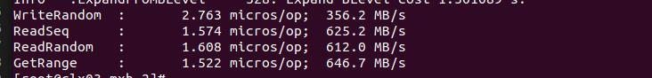
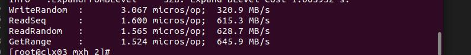
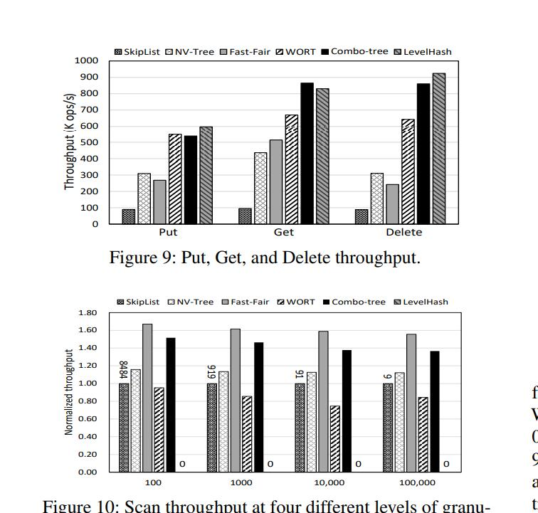
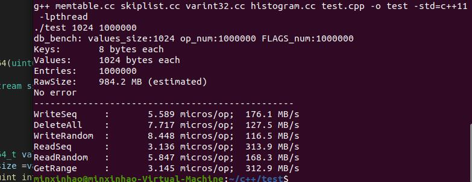

# ScaledKV Test

总的来说，NVM的性能处于DRAM和SSD之间，它的最大读带宽是39.4GB/s，读性能随线程数增加；最大写带宽为13.9 GB/s, 在4线程时获得峰值带宽。在UCSB公布的OptaneDC PMM测试数据中，NVM的随机写时延为305ns，比DRAM慢3.8倍；顺序写时延为169 ns，约为随机写时延的一半，这说明PMM内部有缓存机制。另外，256Byte是Optane DC的内部块大小，表示最小的有效访问粒度。小于256Byte的写操作将造成写放大。大于256Byte，各个大小的读写操作都趋于稳定。顺序写带宽是随机写的4倍，因此合并后的顺序访问不会造成因为256byte写单元造成的写放大。

## ScaledKV Test

> key_size : 8
> value_size : 1024
> key存储空间 ：30G
> value存储空间 ：80G

### 10G

### 30G

### 50G

服务器崩溃，没有

write_seq:227 M/s

50

177

### 70G

## 学长的测试数据

4_0000_0000 kv
k : 8 bytes
value : 256 bytes

## MemTable

> 内存大小： 1G
> 插入数据量: 100_0000 kv
> 插入数据大小： 980M

