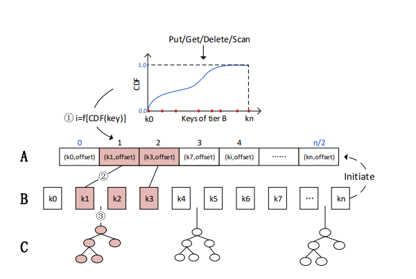
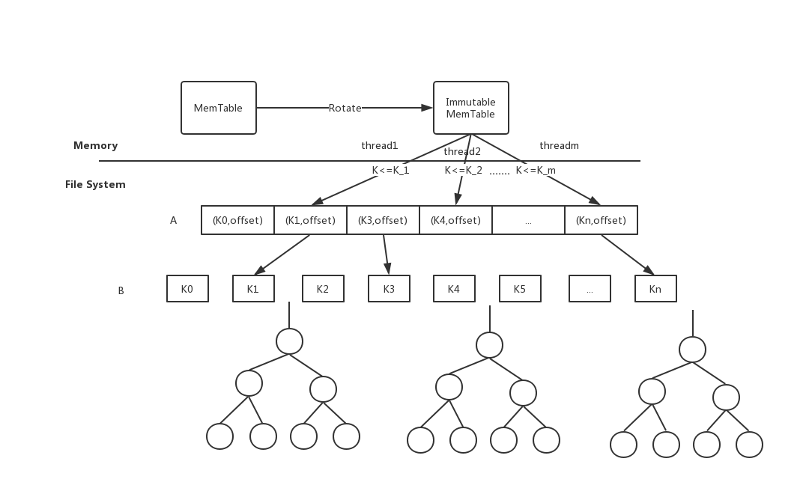

# 1. 设计思路

## 1.1. 背景

Combo-Tree 一个三层结构的索引，具有非侵入性背景调整策略。提供类似hash的单点操作性能并且不牺牲范围查找性能,同时具有可扩展性的树状索引结构。





## 1.2. 思路

在ComboTree的上层使用一个MemTable结构作为在内存中的缓冲，这样既可以达到cache的目的，同时可以把之前向ComboTree的单个写变成周期性的MemTable的Compaction操作。这样对外可以提供更高的读写性能。

修改之后的整体结构如下：



### 1.2.1. 写逻辑

每次写的时候先写内存中的MemTable。当MemTable满了之后转化成一个immutable memtable，因为ComboTree对并发访问友好，所以可以通过多线程将immutable memtable写入到ComboTree中。

根据指定的线程数目参数n,从ComboTree的Tier B中根据类似CDF的计算公式，选取n个范围，作为各个线程插入的参数。这样可以尽量减少不同线程在进行插入过程中产生的访问冲突。

> 在进行权衡后，选择根据immut_的最大key和最小key来划分n个范围。

如果在转换的时候immut_不空，那么说明当前正在进行一次从memtable到ComboTree的compaction操作。我们这里选择将key继续写入mem_，因为这样不会阻塞外部的访问操作，提供更稳定的性能。在immut_写入完成后等待下一次的写mem_操作来触发新的从memtable到ComboTree的compaction操作。

### 1.2.2. 读逻辑

和LevelDB类似。首先查找memtable，如果memtable不命中，那么在immutable memtable中进行查找。如果还不命中，则从底层的ComboTree中进行查找。

## 1.3. 详细设计

### 1.3.1. skiplist & memtable

LevelDB的skiplist和memtable只有insert接口，对插入的同一个key有不同的版本号。在读取时候通过snapshot来确定在读取的时候选择那个value进行输出。通过valuetype标识来区分那些记录的value是无效的，哪些记录的value是有效。

而学长实现的combotree没有快照的概念，也没有复杂的版本管理，所以把leveldb的skiptlist和memtable需要新加上delete、update等接口。

#### 1.3.1.1. skiplist

skiplist的接口和leveldb基本一致。除了增加了Delete操作的接口。

从成员变量上看：

1. 两者的Node结构一样，都是skiplist的一列。
2. 因为是简单的移植，所以不需要提供LevelDB那么丰富的接口。
   1. skiplist的key类型直接使用std::string类型。
   2. comparator直接使用string的compare方法。
   3. 同时因为学长的代码实现了NVM上空间的管理器，所以不需要额外的Arena结构。
   4. 调用c语言库的rand函数即可，不需要Random类。

```cpp
  //LevelDB skipList
  struct Node;

  Comparator const compare_;

  Arena* const arena_;  // Arena used for allocations of nodes

  Node* const head_;

  // Modified only by Insert().  Read racily by readers, but stale
  // values are ok.
  std::atomic<int> max_height_;  // Height of the entire list

  // Read/written only by Insert().
  Random rnd_;
```

```cpp
 struct Node;
    enum{ KMaxHeight = 12};
    Node*  head_ ;
    std::atomic<int> max_height_;
    std::vector<char*> node_ptr;
```

skiplist和memtbale只需要自己在内存上申请和释放空间就可以了，使用一个vector来管理为Node结构申请的内存，在析构时释放。

```cpp
SkipList::Node* SkipList::NewNode(const std::string& key ,int height){
    char* node_memory = (char*)malloc(sizeof(Node)+sizeof(std::atomic<Node*>)*(height-1));
   node_ptr.push_back(node_memory);
   return new (node_memory) Node(key);
}

SkipList::~SkipList(){
    int size = node_ptr.size();
    for(int i = 0;i<size;i++){
        delete node_ptr[i];
    }
    head_ = nullptr;
}
```

接口上，增加了额外的Delete操作接口.这样就不用管理同一个key的多个版本信息了。

```cpp
void SkipList::Delete(const std::string& key){
    Node* prev[KMaxHeight];
    Node* x = FindGreaterOrEqual(key,prev);
    int height = GetMaxHeight();

    // Memtable调用Delete的时候一定经过了MemTable的Get验证的
    // 所以这里不进行key的检查。不然无法匹配。
    // if(x && (x->key.compare(key)==0))
    for(int i = 0;i<height;i++){
        if(prev[i]->NoBarrier_Next(i)==x){
            prev[i]->SetNext(i,x->Next(i));
        }
    }

    for(int i = height-1;i>=0;i--){
        if(head_->Next(i)==nullptr){
            height--;
        }
    }
    max_height_.store(height,std::memory_order_relaxed);
}
```

#### 1.3.1.2. MemTable

在ComboTree的上层使用一个MemTable结构作为在内存中的缓冲，这样既可以达到cache的目的，同时可以把之前向ComboTree的单个写变成周期性的MemTable的Compaction操作。这样对外可以提供更高的读写性能。

##### 1.3.1.2.1. MemTable记录结构

和LevelDB中的记录结构类似，但是我们第三项中不需要记录序列号，所以只需要一个字节。
```cpp
// entry format is:
        //    klength  varint32
        //    userkey  char[klength]
        //    valueType 1 byte
        //    vlength  varint32
        //    value    char[vlength]
```

在插入key/value的时候将key、value、操作类型以及他们的长度封装成一个string。因为我们直接使用string的compare，所以排序的时候会先按长度排序，这个可能是需要修改的地方

##### 1.3.1.2.2. ValueType

MemTable中的数据一定是最新的，所以为了保证MemTable中数据和底层ComboTree数据的一致性，在MemTable的记录有一项用来表示当前value的类型。

1. kTypeValue 表示当前的key在底层的ComboTree中没有，直接插入对应的value。
2. kTypeDeletion 表示当前key在底层存在并且需要进行删除，对应的value长度为0.
3. kTypeUpdate 表示当前key在底层存在，需要用对应的value进行更新。

```cpp
enum ValueType { kTypeDeletion = 0x0, kTypeValue = 0x1,kTypeUpdate = 0x2 };
```

在将MemTable的内容批量写入ComboTree的时候根据ValueType来进行不同的操作。

```cpp
void NVMScaledKV::SingeWrite(MemTableIterator* iter){
        iter->SeekToFirst();
        ValueType valueType;
        std::string key,value;
        while(iter->Valid()){
            valueType = iter->valueType();
            key = iter->key();
            value = iter->value();
            if(valueType==kTypeValue){
                InsertIntoCombo(key,value);
            }else if(valueType==kTypeDeletion){
                DeleteAtCombo(key);
            }else if(valueType==kTypeUpdate){
                UpdateAtCombo(key,value); 
            }
            iter->Next();
        }
        delete iter;
    }
```

### 1.3.2. ComboTree

在内存中增加两个MemTable。先写mem_。当mem_满了之后转换成一个不变的immut_。如果在转换的时候immut_不空，那么说明当前正在进行一次从memtable到ComboTree的compaction操作。我们这里选择将key继续写入mem_，因为这样不会阻塞外部的访问操作，提供更稳定的性能。在immut_写入完成后等待下一次的写mem_操作来触发新的从memtable到ComboTree的compaction操作。

```cpp
    MemTable *mem_;
    MemTable *immut_;

    void NVMScaledKV::Insert(const std::string &key, const std::string &value) {
        //Insert into mem_
        mem_->Add(kTypeValue,key,value);
        tableCount++;
        if(tableCount>=LimitTable){
            if(immut_ == nullptr){
                immut_ = mem_;
                WriteTableToCombo();
            }else{
                 //当前正在将进行一次compaction操作
                return;
            }
            mem_ = new MemTable();
            tableCount=0;
        }
        
    }
```


## 1.4. 测试

由于需要解决兼容性和编译的问题，测试目前正在进行中。