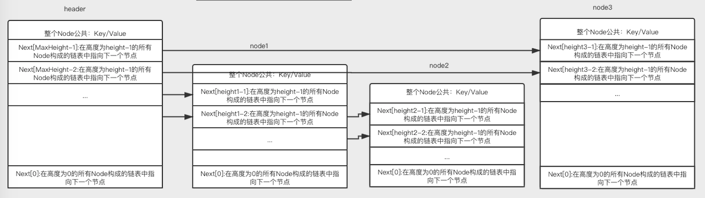

# SkipList Pseudo-Code

之前看过了别人SkipList的实现，也照搬了几版。为了加深理解，这里对SkipList的算法进行一下整理，列出一份伪代码。这样以后实现的时候有更清晰的思路。

## SkipList Node结构体定义

```cpp
//节点  
typedef struct Node  
{  
    int key;  
    int value;  
    struct Node *Next[1];  
}Node;  
```

Node结构的含义如下：


每个Node代表SkipList中的一列，所以公用一个key/value对。每个节点有一个随机大小的Next数组，用来构成相应高度上的链表。这里声明为1只是一种书写二级指针的习惯形式。

## SkipList结构体定义

```cpp
//跳表  
typedef  struct SkipList  
{  
    int level;  
    Node *header;  
}SkipList;  
```
跳表结构示意图如下：



SkipList有一个最大高度的Node为header，它用来存放各个高度上链表的头指针。通过header可以遍历所有高度的链表。
对于各个高度上的链表满足性质：

1. 每一层高度的链表是有序的。
2. 在高层链表出现的元素一定在底层链表上出现。(形象一点就是每一个Node的每一个next一定在对应高度的链表上，而不会出现遗漏/跨越一个或多个Node的链表)
3. 第0层的链表包含所有元素。

这样通过随机分配每个节点的高度，就可以保证在通过向后和向下的操作来查找一个元素的时候的复杂度在概率上均摊下来是O(lgn)的。
具体的分析参考自[复杂度分析](http://blog.sina.com.cn/s/blog_68f6d5370102uykh.html).

## SkipList构造函数

构造一个拥有最大高度的Node为header。并把header的每个next都设置为nullptr。当前SkipList最大高度为0.

## FindGreaterOrEqual

参数：key
     prev数组，存放指向比key小的最大Node的指针
变量：level，标识当前遍历的链表层数。
返回值：指向比key大的最小Node的指针

查找的基本过程是：

1. 初始level为当前SkipList的高度。
2. 在当前层链表从前往后遍历，直到遇见一个Node x，它的next不比目标key大，则设置prev\[level\]为x。并把level减一。
3. 如果level为0，则退出。

伪代码如下：

```cpp
Node* FindGreaterOrEqual(string key,Node* prev){
    int level = GetMaxHeight()-1;//返回当前SkipList的最大高度（除header_外）
    Node* x = header;
    Node* next ;
    while(true){
        next = x->Next[level];
        if(KeyCompare(key,next->key)>0){
            x = next;
        }else{
            prev[level] = x;
            if(level==0)
                return next;
            else
                level--;
        }
    }
}
```

## Insert

要插入一个key，需要构造一个新Node(随机分配一个高度值)，并在SkipList中找到这个Node对应的位置，并更新每一层的链表。

```cpp
void Insert(string key,string value){
    Node prev[MAX_HEIGHT] ; // MAX_HEIGHT为规定的所有Node的高度上限，也是header_的高度。
    FindGreaterOrEqual(key,prev);

    int height = RandomHeight();
    int cur_height = GetMaxHeight();
    if(height > cur_height()){
        for(int i = cur_height ; i < height ; i++){
            prev[i] = header_;
        }
        SetMaxHeight(height);//将SkipList最大高度设置为height
    }

    Node * new_node = NewNode(key,value,height);//构造高度为height的Node
    for(int i = 0 ; i<height; i++){
        new_node->SetNext(i,prev[i]->GetNext());
        prev[i]->SetNext(i,new_node);
    }
}
```

## Search

```cpp
bool Search(string key) const {
  Node* x = FindGreaterOrEqual(key, nullptr);
  if (x != nullptr && KeyCompare(key, x->key)==0) {
    return true;
  } else {
    return false;
  }
}
```

## Delete

```cpp
void Delete(string key,string value){
    Node prev[MAX_HEIGHT] ; // MAX_HEIGHT为规定的所有Node的高度上限，也是header_的高度。
    Node* x = FindGreaterOrEqual(key,prev);

    if (x == nullptr || KeyCompare(key, x->key)!=0) //保证存在要删除的key
        return ;

    for(int i = 0 ; i<height; i++){
        prev[i]->SetNext(i,x->GetNext(i));
    }
    int cur_height = GetMaxHeight();
    for(int i= cur_height-1; i >= 0; i--){    
        if(header_->GetNext(i)==nullptr){    
            SetMaxheight(--cur_height);    
        }    
    }
}
```
